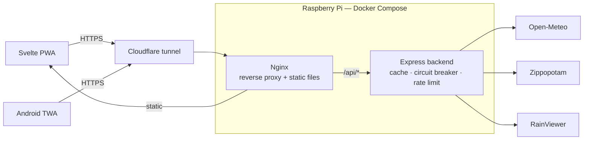

# 🌤️ Météo Québec

🇫🇷 [Version française](./README.md) — this is the canonical version of this document.

[](https://github.com/Alithiel31/WeatherQC/actions/workflows/ci.yml)
[](./LICENSE)
[](https://nodejs.org/)
[](https://www.typescriptlang.org/)
[](https://svelte.dev/)
[](https://www.docker.com/)
[](https://qcweather.alithiel31.dev)
[](https://www.cloudflare.com/)
[](https://play.google.com/store/apps/details?id=dev.alithiel31.qcweather)

Weather forecast app for Quebec: **Express / TypeScript** backend + **Svelte 5 (PWA)** frontend.
Data provided by [Open-Meteo](https://open-meteo.com) — free, no API key.

---

## Features

| Feature | Detail |
|---|---|
| 🌡️ Current conditions | Temperature, feels-like, wind, humidity |
| 🕐 Hourly forecast | Hour by hour over 48 h |
| 📅 Daily forecast | 7 days with min–max bars and sunrise/sunset times |
| 🛰️ Animated map | Cloud satellite (infrared) + precipitation radar via RainViewer + Leaflet |
| 📮 Postal code search | Geocoding of the Quebec FSA (G, H, J) via Zippopotam |
| 🏙️ City selection | 6 cities available (Montréal, Québec, Gatineau, Sherbrooke, Trois-Rivières, Saguenay), choice remembered across sessions |
| 🌅 Dynamic sky | Background gradient based on conditions and day/night |
| 📱 Installable PWA | Works offline — latest forecast cached |
| ⚡ Server-side cache | Configurable via `.env` to limit calls to Open-Meteo |

---

## Architecture

System overview, from the browser to the external APIs:



The browser and the Android app both go through the same Cloudflare tunnel and the same nginx
instance: the TWA is just a shell that loads the PWA from `qcweather.alithiel31.dev`, it never
talks to the backend directly. Nginx serves static files and routes `/api/*` to the Express
backend same-origin (see the Deployment section below). The Express backend is the only
component that calls the external APIs, behind the caching, request-coalescing, and
circuit-breaker layer described in "Upstream resilience" further down — never directly from the
browser.

Repository folder/file layout: see the Structure section further down.

---

## Deployment (Docker)

This is the recommended method. `docker-compose.yml` starts the backend (port **3005**) and the Nginx frontend (port **80**).

**1. Configure the environment**

```bash
cp backend/.env.example backend/.env
# Edit backend/.env with your own Tailscale IP if needed

cp frontend/.env.example frontend/.env
# Edit frontend/.env with an OpenWeatherMap API key (free) to enable the satellite
# map fallback — leaving it empty just shows an unavailability message instead
# of the cloud cover. This same file also serves as the Vite config for local
# development (`npm run dev` in frontend/) : docker compose reads it via the
# --env-file flag (see the command below).
```

**2. Run**

```bash
docker compose --env-file frontend/.env up --build -d
```

Nginx sets the security headers on the served document — CSP, `X-Content-Type-Options`,
`Referrer-Policy`, `Permissions-Policy`, HSTS. `helmet` only covers the JSON responses of
`/api/`: the HTML that actually runs the JavaScript is served by nginx, not Express.

> **Before editing `frontend/nginx.conf`** — `add_header` does not merge: a `location` block
> that declares even one loses **all** of those inherited from `server`. Security headers are
> therefore set only once, and the cache policy relies on `expires`, which doesn't have this
> effect. The CI's `docker` job checks that `assetlinks.json` still carries its CSP.

The app runs on a **Raspberry Pi** and is exposed publicly through a **Cloudflare tunnel** (no port to open on the router).
Nginx acts as a reverse proxy inside the frontend container: it serves static files and forwards `/api/` calls to the backend.
The Cloudflare tunnel handles **HTTPS** and the `qcweather.alithiel31.dev` domain name — no certificate to manage manually.

**Continuous deployment**: `deploy-web.yml` runs on a self-hosted runner installed on the Pi
itself and triggers automatically on every push to `main` touching `backend/`, `frontend/`, or
`docker-compose.yml` (or manually). It replays `docker compose --env-file frontend/.env up -d --build --wait` in place —
the Pi reaches out to GitHub for the job, no inbound port or SSH key to expose. To trigger it and
follow the deployment live from a local machine:

```bash
npm run deploy:web       # or deploy:android for build-twa.yml
```

---

## Android (TWA)

The app is in **internal testing** on the Google Play Store, as a TWA (Trusted Web Activity): a thin Android shell that loads the PWA directly from `https://qcweather.alithiel31.dev`. Public-track publication is expected soon — see the status note below.

**Package ID:** `dev.alithiel31.qcweather` — Sources: `twa-qcweather/`

### CI/CD workflows

| Workflow | Trigger | Role |
|---|---|---|
| `android.yml` | PR or push touching `twa-qcweather/**` | **Unsigned** `bundleRelease` — pre-merge safety net |
| `build-twa.yml` | Push to `twa-qcweather/**` **from `main`**, or manual **from `main`** | Build + sign the `.aab` |
| `deploy-twa.yml` | After `build-twa.yml` succeeds, or manual from `main` | Publish to Play Store (Internal Testing) |

> The production keystore is only decrypted from `main` — `build-twa.yml` and `deploy-twa.yml`
> carry the `github.ref == 'refs/heads/main'` guard, which also covers manual dispatch.
>
> **The production signature therefore only exists on `main`.** Compilation, however, is
> verified from the pull request onwards: `android.yml` runs `bundleRelease` with no secrets at
> all — the project declares no `signingConfig`, Bubblewrap injects the signature at build time,
> and the bundle this safety net produces is unsigned and never published. A Gradle, AGP or
> `androidbrowserhelper` bump therefore fails before the merge, not after.
>
> To reproduce locally: `cd twa-qcweather && ./gradlew bundleRelease`.

> `deploy-twa.yml` requires a **first manual submission** in Play Console — Google requires a version to already exist on the track before accepting uploads via API.

> **Current status**: the version available via `deploy-twa.yml` is limited to testers declared in Play Console (Internal Testing track) — the badge link at the top of this document isn't publicly reachable yet. The move to a production track is in progress; this section will be updated once publication is live.

### Required GitHub secrets

| Secret | Description |
|---|---|
| `KEYSTORE_BASE64` | Android keystore, base64-encoded |
| `KEYSTORE_PASSWORD` | Keystore password |
| `KEY_PASSWORD` | Signing key password |
| `PLAY_SERVICE_ACCOUNT_JSON` | Google Play API Service Account JSON key |

### Setting up the Service Account (once)

1. [Google Cloud Console](https://console.cloud.google.com) → IAM & Admin → Service Accounts → Create
2. Download the JSON key → add it as the `PLAY_SERVICE_ACCOUNT_JSON` secret
3. Play Console → Setup → API access → link the service account → **Release Manager** role

---

## Environment variables

| Variable | Required | Default | Description |
|---|---|---|---|
| `PORT` | ❌ | `3005` | Backend port |
| `NODE_ENV` | ❌ | `development` | Environment (`production` in prod) |
| `TAILSCALE_IP` | ❌ | — | Tailscale IP for remote network access |
| `PUBLIC_ORIGINS` | ❌ | — | CORS origins allowed in addition to the local machine and Tailscale, comma-separated |
| `FETCH_TIMEOUT_MS` | ❌ | `5000` | Max delay of a call to Open-Meteo / Zippopotam |
| `TRUST_PROXY_HOPS` | ❌ | `2` | Number of proxies in front of the API (cloudflared + nginx) |
| `RATE_LIMIT_WINDOW_MS` | ❌ | `60000` | Rate limiting window |
| `RATE_LIMIT_MAX` | ❌ | `100` | Requests/window/IP on `/api` |
| `RATE_LIMIT_GEOCODE_MAX` | ❌ | `20` | Requests/window/IP on `/api/geocode` |
| `CACHE_TTL_PREVISIONS` | ❌ | `600000` | Weather cache duration in ms (default: 10 min) |
| `CACHE_TTL_GEOCODE` | ❌ | `2592000000` | Geocoding cache duration in ms (default: 30 days) |
| `CACHE_TTL_RAINVIEWER` | ❌ | `300000` | RainViewer index cache duration in ms (default: 5 min) |
| `CACHE_MAX_ENTRIES` | ❌ | `500` | Cache entry cap (LRU eviction) |
| `CACHE_FACTEUR_OBSOLETE` | ❌ | `6` | An entry stays servable `factor × TTL` past expiry if the upstream fails |
| `BREAKER_SEUIL_ECHECS` | ❌ | `5` | Consecutive failures before suspending calls to an upstream |
| `BREAKER_REPOS_MS` | ❌ | `30000` | Suspension duration before the test request |
| `DEFAULT_TIMEZONE` | ❌ | `America/Toronto` | Timezone for Open-Meteo forecasts |

Frontend **build** variable (`frontend/.env`, read both by Vite in local development and by
`docker compose` via the `--env-file frontend/.env` flag — see `frontend/.env.example` for
details) : unlike the table above, it isn't validated by Zod server-side, it gets embedded into
the JS bundle by Vite at build time. Compose has no root-level `env_file` directive : the flag
must accompany every invocation touching `docker-compose.yml` (see CI and `deploy-web.yml`).

| Variable | Required | Default | Description |
|---|---|---|---|
| `VITE_OPENWEATHERMAP_KEY` | ❌ | — | OpenWeatherMap API key (free) for the satellite map fallback ; empty = unavailability message instead of the fallback |

---

## Local development

### Backend (port 3005)

```bash
cd backend && npm install
npm run dev        # auto-reload (tsx --watch)
```

Available routes:

| Route | Description |
|---|---|
| `GET /api/villes` | List of available cities |
| `GET /api/previsions/:ville` | Forecast by city (`montreal`, `quebec`, `gatineau`, `sherbrooke`, `trois-rivieres`, `saguenay`) |
| `GET /api/previsions-coordonnees?lat=&lon=&nom=` | Forecast for a GPS point |
| `GET /api/geocode/:codePostal` | Geocodes a Quebec FSA (e.g. `H2X`) |
| `GET /api/rainviewer` | Index of satellite and radar images for the animated map |
| `GET /api/sante` | Service health check |

Calls to external APIs are bounded by `FETCH_TIMEOUT_MS` and retried once on network error or
5xx. An upstream that doesn't respond in time returns a **504**, an upstream in error a
**502** — never a hung request.

All three upstreams go through this same path, RainViewer included: its index used to go
directly from the browser to `api.rainviewer.com`, with no cache and no quota. Only the
**index** is proxied — tiles are still loaded directly from `tilecache.rainviewer.com`, routing
them through the Raspberry Pi would cost far more than what the cache would save. In exchange,
the map now depends on the backend: if it's unreachable, it shows its fallback message instead
of fending for itself.

Allowed CORS origins are the development machine, the Tailscale IP if configured, and those
declared by `PUBLIC_ORIGINS`. In production, nginx proxies `/api/` same-origin: no request
carries an `Origin` header, so a public domain missing from the list shows up on no real
request — until the day a client is served from another host.

The API is publicly exposed: hardening headers (`helmet`), JSON body capped at 10 KB, and rate
limiting per client IP (**429** past the quota). `/api/sante` is never rate-limited — the
Docker healthcheck polls it every 30 s.

External API responses are validated before use: a schema drift at Open-Meteo or Zippopotam
returns a **502** naming the faulty field, never a 500. All errors share the same envelope
`{ status, error }`, to which validation errors add `details`.

Every response carries an `X-Request-Id` header — passed through from the upstream if
provided — that shows up in the logs. A user reporting an outage can quote this ID:

```bash
docker compose --env-file frontend/.env logs backend | grep <id>
```

Every completed request produces a log line — method, path, status, duration, and response
origin (`frais` (fresh), `obsolete` (stale), `amont` (upstream)) — and every upstream call its
own, with its latency. That's what lets you tell "it's Open-Meteo" from "it's the Pi" without
instrumenting anything. Rate limiter rejections, which never reach the error handler, show up
as `warn` with their 429.

`GET /api/sante` rounds out the picture: Node version, uptime, resident memory, cache
statistics (entries, hits, misses, rate) and upstream circuit breaker state.

### Upstream resilience

Three mechanisms, all visible in `/api/sante`:

- **Request coalescing** — N concurrent requests on a cold key trigger only one upstream call.
  Since the TTL is fixed, all warm keys expire together: without this, the burst following an
  expiry would go to the provider in full.
- **Degraded service** — a stale entry stays servable for `CACHE_FACTEUR_OBSOLETE × TTL`, but
  only if the upstream just failed. The response then carries `obsolete: true`, which the app
  displays: a twenty-minute-old forecast beats an error screen. On the service worker side, a
  Workbox plugin treats a 5xx as a network failure — otherwise `NetworkFirst` would never fall
  back to the cache, a 502 being a *resolved* response.
- **Circuit breaker** — past `BREAKER_SEUIL_ECHECS` consecutive failures, calls to that
  upstream are suspended for `BREAKER_REPOS_MS` and respond **503** immediately, then a single
  request tests whether the service is back. Without it, a dead upstream would tie up ~10 s of
  connection per request, multiplied by the number of clients — on a Pi capped at 256 MB, a
  third-party outage became a local resource exhaustion.

An invalid environment variable (`PORT=abc`, empty quota) fails startup while naming it,
instead of letting the server run with a `NaN`.

> **Calibrating `TRUST_PROXY_HOPS`** — rate limiting applies per client IP. Behind cloudflared
> then nginx, you need to walk back 2 hops to recover the real client; misconfigured, all
> visitors share the same counter. After an infrastructure change, verify with
> `curl -s https://qcweather.alithiel31.dev/api/villes -D - | grep -i ratelimit` from two
> different networks: the counters must be independent.

### Tests (backend)

| Command | Scope | Network |
|---|---|---|
| `npm run test:run` | Unit + integration — run by the `pre-push` hook | ❌ no network call |
| `npm run test:unit` | Unit only | ❌ no network call |
| `npm run test:coverage` | Same + coverage report — **this is what CI runs** | ❌ no network call |
| `npm run test:contract` | Verifies the real contract of Open-Meteo, Zippopotam and RainViewer | ✅ real calls |

Integration tests rely on the fixtures in `backend/tests/fixtures/`: an external API outage can
no longer fail a PR. `tests/setup.ts` explicitly fails any unmocked network call.

Contract tests run separately via the `contract.yml` workflow (nightly + manual): this is what
detects a schema drift at the external APIs. On failure it **opens an issue** labeled
`derive-contrat`, and reuses it while it stays open — a detection nobody reads isn't a
detection.

The CI's `docker` job no longer just builds the images: it starts the stack with
`docker compose up --wait` — which exercises the backend healthcheck, the frontend's
`depends_on: service_healthy`, and the nginx configuration on its real network — then queries
`/api/sante`, `/api/villes`, and the app shell through nginx. An invalid environment variable,
a broken healthcheck, or a faulty nginx config now fail in CI rather than at deployment.

> An isolated `nginx -t` in a container doesn't work here: `proxy_pass http://backend:3005`
> requires resolving the `backend` host, which only exists inside the compose network. The
> real startup is what serves as the test.

`test:coverage` fails below the thresholds declared in `backend/vitest.config.ts`. They're set
**below the actual measurement**, not a round number: they block an outright regression
without breaking CI as soon as a refactor adds a hard-to-reach guard. `app.ts` is excluded from
the measurement — it only contains `listen()` and the signal handlers, whose real verification
is the Docker healthcheck.

### Frontend (port 5173)

```bash
cd frontend && npm install
npm run dev
```

Open `http://localhost:5173`. The Vite proxy forwards `/api` to the backend.

All network calls go through `src/lib/api.ts` — the only place `fetch` is called on the
frontend, which lets it be stubbed in one block in tests.

### Tests (frontend)

| Command | Scope |
|---|---|
| `npm run test` | Watch mode during development |
| `npm run test:run` | A single full pass |
| `npm run test:coverage` | Same + coverage report |
| `npm run test:ci` | Same + `rapport-tests.json` — **this is what CI runs** |
| `npm run test:pwa` | PWA checks only (manifest + service worker) |
| `npm run test:e2e` | End-to-end run in Chromium (Playwright) |

CI publishes `frontend/coverage/` and `frontend/rapport-tests.json` as an artifact
(`frontend-rapports`, kept 14 days), including when the job fails — that's when the report is
most useful.

`jsdom` environment + Testing Library. As on the backend, `tests/setup.ts` explicitly fails any
unmocked network call: a test can't depend on the backend or RainViewer being available.

Coverage thresholds live in `frontend/vitest.config.ts`, set below the actual measurement.
`src/main.ts` is excluded from it: it only mounts the app and registers the service worker.

### End-to-end

`e2e/` opens the **built** app in Chromium via Playwright: city selection and persistence of
the choice, postal code search, backend error message, "Retry" button, offline toggle, startup
with corrupted storage.

The API is doubled by Playwright rather than served by the real backend. An end-to-end suite
that depends on Open-Meteo would become exactly what `tests/setup.ts` forbids everywhere else:
a test that fails for a reason unrelated to the code. The service worker is neutralized for the
same reason — it would intercept requests before the doubles, and its guarantees are already
verified on the build output by `tests/pwa/build.test.ts`.

```bash
cd frontend && npm run test:e2e
```

> An environment that already provides Chromium can point to it via
> `PLAYWRIGHT_CHROMIUM_PATH` instead of downloading a second one, often of a version
> incompatible with what Playwright expects.

### PWA checks

`tests/pwa/build.test.ts` rebuilds the app and reads the `dist/` output to verify the two
promises advertised above — installability and offline operation:

- the manifest declares `display: standalone`, a `start_url`, the 192/512 icons and a
  `maskable` icon, and only references files that actually exist;
- the service worker is generated, registered by the bundle, and precaches the app shell;
- the expected caching strategies are wired up correctly (`NetworkFirst` on
  `/api/previsions`, `CacheFirst` on background tiles).

```bash
cd frontend && npm run test:pwa
```

> **Why not Lighthouse** — since Lighthouse 12, the PWA category and its audits
> (`installable-manifest`, `service-worker`) have been **removed**; Lighthouse 13 only knows
> `performance`, `accessibility`, `best-practices` and `seo`. Auditing installability would
> require pinning an abandoned version, plus headless Chrome and a static server in CI. The
> same guarantees can be read from the build output, in a few seconds and without a browser.

---

## Structure

```
meteo-qc/
├── docker-compose.yml
├── backend/
│   ├── app.ts                        # Entry point (startup, graceful shutdown)
│   ├── .env.example                  # Environment variables template
│   └── src/
│       ├── index.ts                  # Builds the Express app
│       ├── config.ts                 # Validated environment variables (Zod)
│       ├── data/cities.ts            # Cities and coordinates
│       ├── routers/                  # Route definitions
│       ├── controllers/              # Request logic
│       ├── services/                 # Open-Meteo, geocoding, RainViewer, cache
│       ├── middlewares/              # Errors, rate-limit, request-id, access log
│       ├── schemas/                  # Zod validation of upstream responses
│       └── lib/                      # Circuit breaker, errors, log, HTTP requests
└── frontend/
    ├── src/
    │   ├── main.ts                        # App mount + service worker
    │   ├── App.svelte                     # Active city, dynamic sky
    │   └── lib/
    │       ├── Horaire.svelte             # 48 h hourly strip
    │       ├── CarteNuages.svelte         # Animated Leaflet map
    │       ├── Quotidien.svelte           # 7-day forecast
    │       ├── ConditionsActuelles.svelte # Temperature, feels-like, wind, humidity
    │       ├── RechercheCodePostal.svelte # Postal code search
    │       ├── animationFrames.svelte.ts  # Map animation state machine
    │       ├── preferences.svelte.ts      # Remembered city and preferences
    │       ├── stockage.ts                # Failure-tolerant localStorage access
    │       ├── api.ts                     # Backend and RainViewer calls
    │       ├── meteo.ts                   # WMO codes → labels, icons
    │       └── types.ts                   # TypeScript interfaces
    └── tests/
        ├── unit/                   # meteo.ts, api.ts
        ├── composants/             # Svelte rendering (Testing Library)
        ├── pwa/                    # Installable manifest + service worker
        └── helpers/                # Fetch stubs
```

---

## Adding a city

Add an entry to `backend/src/data/cities.ts`.

---

## Notes

**Postal code precision** — the app uses the FSA (first 3 characters, e.g. `H2X`) rather than the full postal code, which localizes to roughly the neighborhood — enough for weather model resolution (a few kilometers).

---

## Privacy and terms

Three static pages, served from `frontend/public/` and linked from the application footer. French is
the official version — the service is offered to the public in Québec — and the English versions are
courtesy translations.

| Document | Français | English |
|---|---|---|
| Privacy policy | [`/privacy-policy.html`](https://qcweather.alithiel31.dev/privacy-policy.html) | [`/privacy-policy.en.html`](https://qcweather.alithiel31.dev/privacy-policy.en.html) |
| Terms of use | [`/terms.html`](https://qcweather.alithiel31.dev/terms.html) | [`/terms.en.html`](https://qcweather.alithiel31.dev/terms.en.html) |
| Legal notice | [`/legal.html`](https://qcweather.alithiel31.dev/legal.html) | [`/legal.en.html`](https://qcweather.alithiel31.dev/legal.en.html) |

> ⚠️ **`privacy-policy.html` must not be renamed.** That exact URL is declared in the Play Console;
> moving it breaks the app listing, and the failure only surfaces at Google's next review.
> `tests/pwa/build.test.ts` and the CI `docker` job both check for it.

These pages depend on no router: they are standalone HTML files that Vite copies into `dist/`, that
nginx serves through its `location /` fallback, and that Workbox precaches — which is what makes
them readable offline. **The precache is not cosmetic**: without it, the service worker's
`navigateFallback` would serve the application shell in their place.

The content describes what the code actually does — `localStorage` keys, third parties called by the
browser *and* by the backend, logs, per-IP rate limiting. Any change to data handling must be
reflected there, and in the Play Console **Data Safety** form, which is maintained in the console
rather than in this repository.

---

## Stack

| Layer | Technology |
|---|---|
| Backend | Express 5 · Node.js 22+ · TypeScript 5.6 |
| Frontend | Svelte 5 · TypeScript · Vite 8 |
| PWA | vite-plugin-pwa · Service Worker (network-first) |
| Map | Leaflet · RainViewer |
| Infra | Docker · Nginx |
| Network access | Tailscale |
| External APIs | Open-Meteo · Zippopotam.us · CARTO / OpenStreetMap |
| Android | TWA · Bubblewrap · Google Play Store |
| CI/CD | GitHub Actions (`ci.yml` · `android.yml` · `build-twa.yml` · `deploy-twa.yml` · `deploy-web.yml` · `codeql.yml` · `secrets.yml` · `contract.yml`) |

## Contributing

Development environment, reproducing CI locally, commit convention: see [CONTRIBUTING.en.md](./CONTRIBUTING.en.md).

## Troubleshooting

Known cases (nginx config, network calibration, CI): see [TROUBLESHOOTING.en.md](./TROUBLESHOOTING.en.md).

## License

MIT — see [LICENSE](./LICENSE)

---

Made by **Jacques Duchamplecheval** ([alithiel31](https://github.com/Alithiel31)) — [alithiel31.dev](https://alithiel31.dev) · [LinkedIn](https://linkedin.com/in/jacques-duchamplecheval) · [contact@alithiel31.dev](mailto:contact@alithiel31.dev)
