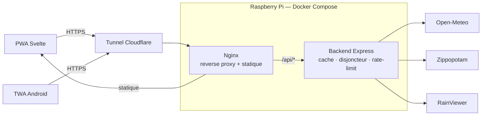

# 🌤️ Météo Québec

🇬🇧 [English version](./README.en.md)

[](https://github.com/Alithiel31/WeatherQC/actions/workflows/ci.yml)
[](./LICENSE)
[](https://nodejs.org/)
[](https://www.typescriptlang.org/)
[](https://svelte.dev/)
[](https://www.docker.com/)
[](https://qcweather.alithiel31.dev)
[](https://www.cloudflare.com/)
[](https://play.google.com/store/apps/details?id=dev.alithiel31.qcweather)

Application de prévisions météo pour le Québec : backend **Express / TypeScript** + frontend **Svelte 5 (PWA)**.
Données fournies par [Open-Meteo](https://open-meteo.com) — gratuit, sans clé API.

---

## Fonctionnalités

| Fonctionnalité | Détail |
|---|---|
| 🌡️ Conditions actuelles | Température, ressenti, vent, humidité |
| 🕐 Prévisions horaires | Heure par heure sur 48 h |
| 📅 Prévisions quotidiennes | 7 jours avec barres min–max et heures de lever/coucher |
| 🛰️ Carte animée | Satellite nuages (infrarouge) + radar précipitations via RainViewer + Leaflet, avec repli sur la couverture nuageuse OpenWeatherMap quand RainViewer n'a pas d'image satellite |
| 📮 Recherche par code postal | Géocodage de la RTA québécoise (G, H, J) via Zippopotam |
| 🏙️ Sélection de ville | 6 villes disponibles (Montréal, Québec, Gatineau, Sherbrooke, Trois-Rivières, Saguenay), choix mémorisé entre les sessions |
| 🌅 Ciel dynamique | Dégradé d'arrière-plan selon les conditions et le jour/nuit |
| 📱 PWA installable | Fonctionne hors ligne — dernières prévisions en cache |
| ⚡ Cache serveur | Configurable via `.env` pour limiter les appels à Open-Meteo |

---

## Architecture

Vue d'ensemble du système, du navigateur jusqu'aux APIs externes :



Le navigateur et l'app Android passent tous deux par le même tunnel Cloudflare et la même
instance nginx : la TWA n'est qu'une coquille qui charge le PWA depuis
`qcweather.alithiel31.dev`, elle ne parle jamais directement au backend. Nginx sert les
fichiers statiques et route `/api/*` vers le backend Express en same-origin (voir section
Déploiement ci-dessous). Le backend Express est le seul composant qui appelle les APIs
externes, derrière la couche de cache, de mutualisation des requêtes et de disjoncteur décrite
dans « Résilience des amonts » plus bas — jamais directement depuis le navigateur.

Détail des dossiers et fichiers du dépôt : voir la section Structure plus bas.

---

## Déploiement (Docker)

C'est la méthode recommandée. Le `docker-compose.yml` lance le backend (port **3005**) et le frontend Nginx (port **80**).

**1. Configurer l'environnement**

```bash
cp backend/.env.example backend/.env
# Éditer backend/.env avec ta propre IP Tailscale si nécessaire

cp frontend/.env.example frontend/.env
# Éditer frontend/.env avec une clé OpenWeatherMap (gratuite) pour activer le repli
# de la carte satellite — laisser vide se contente d'afficher un message
# d'indisponibilité quand RainViewer n'a pas d'image. Ce même fichier sert aussi
# de config Vite en développement local (`npm run dev` dans frontend/) : docker
# compose le lit via `env_file` en tête de docker-compose.yml.
```

**2. Lancer**

```bash
docker compose up --build -d
```

Nginx pose les en-têtes de sécurité du document — CSP, `X-Content-Type-Options`,
`Referrer-Policy`, `Permissions-Policy`, HSTS. `helmet` ne couvre que les réponses JSON de
`/api/` : le HTML qui exécute le JavaScript est servi par nginx, pas par Express.

> **Avant d'éditer `frontend/nginx.conf`** — `add_header` ne fusionne pas : un bloc `location`
> qui en déclare un seul perd **tous** ceux hérités du `server`. Les en-têtes sont donc posés
> une seule fois, et la politique de cache s'appuie sur `expires`, qui n'a pas cet effet. Le
> job `docker` de la CI vérifie que `assetlinks.json` porte toujours sa CSP.

L'application tourne sur un **Raspberry Pi** et est exposée publiquement via un **tunnel Cloudflare** (aucun port à ouvrir sur le routeur).
Nginx fait office de reverse proxy à l'intérieur du conteneur frontend : il sert les fichiers statiques et redirige les appels `/api/` vers le backend.
Le tunnel Cloudflare gère le **HTTPS** et le nom de domaine `qcweather.alithiel31.dev` — aucun certificat à gérer manuellement.

**Déploiement continu** : `deploy-web.yml` tourne sur un runner self-hosted installé sur le Pi
lui-même et se déclenche automatiquement à chaque push sur `main` touchant `backend/`,
`frontend/` ou `docker-compose.yml` (ou manuellement). Il rejoue `docker compose up -d --build
--wait` sur place — le Pi va chercher le job en se connectant vers GitHub, aucun port entrant ni
clé SSH à exposer. Pour le déclencher et suivre le déploiement en direct depuis un poste local :

```bash
npm run deploy:web       # ou deploy:android pour build-twa.yml
```

---

## Android (TWA)

L'application est en **test interne** (Internal Testing) sur le Google Play Store, sous forme de TWA (Trusted Web Activity) : une coquille Android légère qui charge directement le PWA depuis `https://qcweather.alithiel31.dev`. La publication en piste publique est prévue à court terme — voir la note de statut ci-dessous.

**Package ID :** `dev.alithiel31.qcweather` — Sources : `twa-qcweather/`

### Workflows CI/CD

| Workflow | Déclencheur | Rôle |
|---|---|---|
| `android.yml` | PR ou push touchant `twa-qcweather/**` | `bundleRelease` **non signé** — filet avant merge |
| `build-twa.yml` | Push sur `twa-qcweather/**` **depuis `main`**, ou manuel **depuis `main`** | Build + signature du `.aab` |
| `deploy-twa.yml` | Après `build-twa.yml` réussi, ou manuel depuis `main` | Publication sur Play Store (Internal Testing) |

> Le keystore de production n'est déchiffré que depuis `main` — `build-twa.yml` et
> `deploy-twa.yml` portent la garde `github.ref == 'refs/heads/main'`, qui couvre aussi le
> déclenchement manuel.
>
> **La signature de production n'existe donc que sur `main`.** La compilation, elle, est
> vérifiée dès la PR : `android.yml` exécute `bundleRelease` sans aucun secret — le projet ne
> déclare pas de `signingConfig`, Bubblewrap injecte la signature au moment du build, et le
> bundle produit par ce filet est non signé et jamais publié. Une montée de Gradle, d'AGP ou
> d'`androidbrowserhelper` échoue donc avant merge, pas après.
>
> Pour reproduire en local : `cd twa-qcweather && ./gradlew bundleRelease`.

> `deploy-twa.yml` nécessite une **première soumission manuelle** dans Play Console — Google exige qu'une version existe déjà sur la piste avant d'accepter les uploads via API.

> **Statut actuel** : la version disponible via `deploy-twa.yml` est limitée aux testeurs déclarés dans Play Console (piste Internal Testing) — le lien du badge en haut de ce document n'est donc pas encore accessible au public. La bascule vers une piste de production est en cours ; cette section sera mise à jour dès la publication effective.

### Secrets GitHub requis

| Secret | Description |
|---|---|
| `KEYSTORE_BASE64` | Keystore Android encodé en base64 |
| `KEYSTORE_PASSWORD` | Mot de passe du keystore |
| `KEY_PASSWORD` | Mot de passe de la clé de signature |
| `PLAY_SERVICE_ACCOUNT_JSON` | Clé JSON du Service Account Google Play API |

### Configurer le Service Account (une fois)

1. [Google Cloud Console](https://console.cloud.google.com) → IAM & Admin → Service Accounts → Créer
2. Télécharger la clé JSON → ajouter comme secret `PLAY_SERVICE_ACCOUNT_JSON`
3. Play Console → Setup → API access → lier le service account → rôle **Release Manager**

---

## Variables d'environnement

| Variable | Obligatoire | Défaut | Description |
|---|---|---|---|
| `PORT` | ❌ | `3005` | Port du backend |
| `NODE_ENV` | ❌ | `development` | Environnement (`production` en prod) |
| `TAILSCALE_IP` | ❌ | — | IP Tailscale pour l'accès réseau distant |
| `PUBLIC_ORIGINS` | ❌ | — | Origines CORS autorisées en plus du poste local et de Tailscale, séparées par des virgules |
| `FETCH_TIMEOUT_MS` | ❌ | `5000` | Délai maximal d'un appel à Open-Meteo / Zippopotam |
| `TRUST_PROXY_HOPS` | ❌ | `2` | Nombre de proxies devant l'API (cloudflared + nginx) |
| `RATE_LIMIT_WINDOW_MS` | ❌ | `60000` | Fenêtre de la limitation de débit |
| `RATE_LIMIT_MAX` | ❌ | `100` | Requêtes/fenêtre/IP sur `/api` |
| `RATE_LIMIT_GEOCODE_MAX` | ❌ | `20` | Requêtes/fenêtre/IP sur `/api/geocode` |
| `CACHE_TTL_PREVISIONS` | ❌ | `600000` | Durée du cache météo en ms (défaut : 10 min) |
| `CACHE_TTL_GEOCODE` | ❌ | `2592000000` | Durée du cache géocodage en ms (défaut : 30 jours) |
| `CACHE_TTL_RAINVIEWER` | ❌ | `300000` | Durée du cache de l'index RainViewer en ms (défaut : 5 min) |
| `CACHE_MAX_ENTRIES` | ❌ | `500` | Plafond du nombre d'entrées en cache (éviction LRU) |
| `CACHE_FACTEUR_OBSOLETE` | ❌ | `6` | Une entrée reste servable `facteur × TTL` après péremption si l'amont échoue |
| `BREAKER_SEUIL_ECHECS` | ❌ | `5` | Échecs consécutifs avant suspension des appels à un amont |
| `BREAKER_REPOS_MS` | ❌ | `30000` | Durée de la suspension avant la requête de test |
| `DEFAULT_TIMEZONE` | ❌ | `America/Toronto` | Timezone pour les prévisions Open-Meteo |

Variable de **build** frontend (`frontend/.env`, lue à la fois par Vite en développement local
et par `docker compose` via `env_file` — voir `frontend/.env.example` pour le détail) :
contrairement au tableau ci-dessus, elle n'est pas validée par Zod côté serveur, elle est
embarquée dans le bundle JS par Vite au moment du build.

| Variable | Obligatoire | Défaut | Description |
|---|---|---|---|
| `VITE_OPENWEATHERMAP_KEY` | ❌ | — | Clé API OpenWeatherMap (gratuite) pour le repli de la carte satellite ; vide = message d'indisponibilité au lieu du repli |

---

## Développement local

### Backend (port 3005)

```bash
cd backend && npm install
npm run dev        # rechargement auto (tsx --watch)
```

Routes disponibles :

| Route | Description |
|---|---|
| `GET /api/villes` | Liste des villes disponibles |
| `GET /api/previsions/:ville` | Prévisions par ville (`montreal`, `quebec`, `gatineau`, `sherbrooke`, `trois-rivieres`, `saguenay`) |
| `GET /api/previsions-coordonnees?lat=&lon=&nom=` | Prévisions pour un point GPS |
| `GET /api/geocode/:codePostal` | Géocode une RTA québécoise (ex. `H2X`) |
| `GET /api/rainviewer` | Index des images satellite et radar pour la carte animée |
| `GET /api/sante` | Vérification de l'état du service |

Les appels aux APIs externes sont bornés par `FETCH_TIMEOUT_MS` et rejoués une fois en cas
d'erreur réseau ou 5xx. Un amont qui ne répond pas à temps donne un **504**, un amont en
erreur un **502** — jamais une requête suspendue.

Les trois amonts passent par ce même chemin, RainViewer compris : son index transitait
autrefois directement du navigateur vers `api.rainviewer.com`, sans cache ni quota. Seul
l'**index** est proxifié — les tuiles restent chargées en direct depuis
`tilecache.rainviewer.com`, les faire transiter par le Raspberry Pi coûterait bien plus cher
que ce que le cache ferait gagner. En contrepartie, la carte dépend désormais du backend :
si celui-ci est injoignable, elle affiche son message de repli au lieu de se débrouiller
seule.

Les origines CORS autorisées sont le poste de développement, l'IP Tailscale si elle est
configurée, et celles déclarées par `PUBLIC_ORIGINS`. En production, nginx proxifie `/api/`
en same-origin : aucune requête ne porte d'en-tête `Origin`, donc un domaine public absent de
la liste ne se voit sur aucune requête réelle — jusqu'au jour où un client est servi depuis
un autre hôte.

L'API est exposée publiquement : en-têtes de durcissement (`helmet`), corps JSON plafonné à
10 ko et limitation de débit par IP cliente (**429** au-delà du quota). `/api/sante` n'est
jamais limité — le healthcheck Docker l'interroge toutes les 30 s.

Les réponses des APIs externes sont validées avant usage : une dérive de schéma chez Open-Meteo
ou Zippopotam donne un **502** nommant le champ fautif, jamais un 500. Toutes les erreurs
partagent la même enveloppe `{ status, error }`, à laquelle les erreurs de validation ajoutent
`details`.

Chaque réponse porte un en-tête `X-Request-Id` — repris de l'amont s'il est fourni — qu'on
retrouve dans les logs. Un utilisateur qui signale une panne peut citer cet identifiant :

```bash
docker compose logs backend | grep <identifiant>
```

Chaque requête terminée produit une ligne — méthode, chemin, statut, durée, et l'origine de la
réponse (`frais`, `obsolete`, `amont`) — et chaque appel amont la sienne, avec sa latence.
C'est ce qui permet de trancher « c'est Open-Meteo » de « c'est le Pi » sans instrumenter quoi
que ce soit. Les rejets du limiteur, qui n'atteignent jamais le gestionnaire d'erreurs,
apparaissent en `warn` avec leur 429.

`GET /api/sante` complète le tableau : version de Node, temps depuis le démarrage, mémoire
résidente, statistiques de cache (entrées, hits, misses, taux) et état des disjoncteurs amont.

### Résilience des amonts

Trois mécanismes, tous visibles dans `/api/sante` :

- **Mutualisation** — N requêtes simultanées sur une clé froide ne déclenchent qu'un seul appel
  amont. Le TTL étant fixe, toutes les clés chaudes expirent ensemble : sans cela, la rafale
  suivant une expiration partait en entier chez le fournisseur.
- **Service dégradé** — une entrée périmée reste servable `CACHE_FACTEUR_OBSOLETE × TTL`, mais
  uniquement si l'amont vient d'échouer. La réponse porte alors `obsolete: true` et
  l'application l'affiche : des prévisions d'il y a vingt minutes valent mieux qu'un écran
  d'erreur. Côté service worker, un greffon Workbox traite un 5xx comme une panne réseau —
  sans quoi `NetworkFirst` ne consultait jamais le cache, un 502 étant une réponse *résolue*.
- **Disjoncteur** — au-delà de `BREAKER_SEUIL_ECHECS` échecs consécutifs, les appels à cet
  amont sont suspendus pendant `BREAKER_REPOS_MS` et répondent **503** immédiatement, puis une
  seule requête teste le retour du service. Sans lui, un amont mort immobilisait ~10 s de
  connexion par requête, multipliées par le nombre de clients — sur un Pi borné à 256 Mo, une
  panne tierce devenait un épuisement local.

Une variable d'environnement invalide (`PORT=abc`, quota vide) fait échouer le démarrage en la
nommant, au lieu de laisser tourner le serveur avec un `NaN`.

> **Calibrage de `TRUST_PROXY_HOPS`** — la limitation de débit s'applique par IP cliente.
> Derrière cloudflared puis nginx, il faut remonter 2 sauts pour retrouver le vrai client ;
> mal réglé, tous les visiteurs partagent le même compteur. Après un changement d'infra,
> vérifier avec `curl -s https://qcweather.alithiel31.dev/api/villes -D - | grep -i ratelimit`
> depuis deux réseaux différents : les compteurs doivent être indépendants.

### Tests (backend)

| Commande | Portée | Réseau |
|---|---|---|
| `npm run test:run` | Unitaires + intégration — lancé par le hook `pre-push` | ❌ aucun appel réseau |
| `npm run test:unit` | Unitaires seuls | ❌ aucun appel réseau |
| `npm run test:coverage` | Idem + rapport de couverture — **c'est ce que lance la CI** | ❌ aucun appel réseau |
| `npm run test:contract` | Vérifie le contrat réel d'Open-Meteo, de Zippopotam et de RainViewer | ✅ appels réels |

Les tests d'intégration s'appuient sur les fixtures de `backend/tests/fixtures/` : une panne
d'API externe ne peut plus faire échouer une PR. `tests/setup.ts` fait échouer explicitement
tout appel réseau non mocké.

Les tests de contrat tournent séparément via le workflow `contract.yml` (nocturne + manuel) :
c'est lui qui détecte une dérive de schéma chez les APIs externes. En cas d'échec il **ouvre
une issue** étiquetée `derive-contrat`, et la réutilise tant qu'elle est ouverte — une
détection que personne ne lit n'est pas une détection.

Le job `docker` de la CI ne se contente plus de construire les images : il démarre la pile avec
`docker compose up --wait` — ce qui exerce le healthcheck du backend, le
`depends_on: service_healthy` du frontend et la configuration nginx dans son vrai réseau —
puis interroge `/api/sante`, `/api/villes` et la coquille applicative à travers nginx. Une
variable d'environnement invalide, un healthcheck cassé ou une config nginx fautive échouent
désormais en CI plutôt qu'au déploiement.

> `nginx -t` dans un conteneur isolé ne convient pas ici : `proxy_pass http://backend:3005`
> exige de résoudre l'hôte `backend`, qui n'existe que dans le réseau du compose. C'est le
> démarrage réel qui fait office de test.

`test:coverage` échoue sous les seuils déclarés dans `backend/vitest.config.ts`. Ils sont
calés **sous la mesure réelle**, pas sur un chiffre rond : ils bloquent une régression
franche sans casser la CI dès qu'un refactor ajoute une garde difficile à atteindre.
`app.ts` est exclu de la mesure — il ne contient que `listen()` et les gestionnaires de
signaux, dont la vérification réelle est le healthcheck Docker.

### Frontend (port 5173)

```bash
cd frontend && npm install
npm run dev
```

Ouvrir `http://localhost:5173`. Le proxy Vite redirige `/api` vers le backend.

Tous les appels réseau passent par `src/lib/api.ts` — c'est le seul endroit où `fetch`
est appelé côté frontend, ce qui permet de le stubber d'un bloc dans les tests.

### Tests (frontend)

| Commande | Portée |
|---|---|
| `npm run test` | Mode watch pendant le développement |
| `npm run test:run` | Une passe complète |
| `npm run test:coverage` | Idem + rapport de couverture |
| `npm run test:ci` | Idem + `rapport-tests.json` — **c'est ce que lance la CI** |
| `npm run test:pwa` | Uniquement les vérifications PWA (manifeste + service worker) |
| `npm run test:e2e` | Parcours de bout en bout dans Chromium (Playwright) |

La CI publie `frontend/coverage/` et `frontend/rapport-tests.json` en artefact
(`frontend-rapports`, conservé 14 jours), y compris quand le job échoue — c'est là que le
rapport est le plus utile.

Environnement `jsdom` + Testing Library. Comme côté backend, `tests/setup.ts` fait échouer
explicitement tout appel réseau non mocké : un test ne peut pas dépendre de la disponibilité
du backend ou de RainViewer.

Les seuils de couverture vivent dans `frontend/vitest.config.ts`, calés sous la mesure
réelle. `src/main.ts` en est exclu : il ne fait que monter l'app et enregistrer le service
worker.

### Parcours de bout en bout

`e2e/` ouvre l'application **construite** dans Chromium via Playwright : sélection de ville et
persistance du choix, recherche par code postal, message d'erreur du backend, bouton
« Réessayer », bascule hors ligne, démarrage avec un stockage corrompu.

L'API y est doublée par Playwright plutôt que servie par le vrai backend. Une suite de bout en
bout qui dépend d'Open-Meteo redevient exactement ce que `tests/setup.ts` interdit partout
ailleurs : un test qui échoue pour une raison étrangère au code. Le service worker est
neutralisé pour la même raison — il intercepterait les requêtes avant les doublures, et ses
garanties sont déjà vérifiées sur la sortie de build par `tests/pwa/build.test.ts`.

```bash
cd frontend && npm run test:e2e
```

> Un environnement fournissant déjà Chromium peut le désigner par
> `PLAYWRIGHT_CHROMIUM_PATH` au lieu d'en télécharger un second, souvent d'une version
> incompatible avec celle qu'attend Playwright.

### Vérifications PWA

`tests/pwa/build.test.ts` reconstruit l'app et lit la sortie de `dist/` pour vérifier les
deux promesses affichées plus haut — installabilité et fonctionnement hors ligne :

- le manifeste déclare `display: standalone`, un `start_url`, les icônes 192/512 et une
  icône `maskable`, et n'y référence que des fichiers réellement présents ;
- le service worker est généré, enregistré par le bundle, et précache la coquille ;
- les stratégies de cache attendues sont bien câblées (`NetworkFirst` sur
  `/api/previsions`, `CacheFirst` sur les tuiles de fond).

```bash
cd frontend && npm run test:pwa
```

> **Pourquoi pas Lighthouse** — depuis Lighthouse 12, la catégorie PWA et ses audits
> (`installable-manifest`, `service-worker`) ont été **supprimés** ; Lighthouse 13 ne
> connaît plus que `performance`, `accessibility`, `best-practices` et `seo`. Auditer
> l'installabilité imposerait d'épingler une version abandonnée, plus un Chrome headless
> et un serveur statique en CI. Les mêmes garanties se lisent dans la sortie de build,
> en quelques secondes et sans navigateur.

---

## Structure

```
meteo-qc/
├── docker-compose.yml
├── backend/
│   ├── app.ts                        # Point d'entrée (démarrage, arrêt gracieux)
│   ├── .env.example                  # Template des variables d'environnement
│   └── src/
│       ├── index.ts                  # Construction de l'app Express
│       ├── config.ts                 # Variables d'environnement validées (Zod)
│       ├── data/cities.ts            # Villes et coordonnées
│       ├── routers/                  # Définition des routes
│       ├── controllers/              # Logique des requêtes
│       ├── services/                 # Open-Meteo, géocodage, RainViewer, cache
│       ├── middlewares/              # Erreurs, rate-limit, request-id, accès
│       ├── schemas/                  # Validation Zod des réponses amont
│       └── lib/                      # Disjoncteur, erreurs, log, requêtes HTTP
└── frontend/
    ├── src/
    │   ├── main.ts                        # Montage de l'app + service worker
    │   ├── App.svelte                     # Ville active, ciel dynamique
    │   └── lib/
    │       ├── Horaire.svelte             # Bandeau 48 h
    │       ├── CarteNuages.svelte         # Carte Leaflet animée
    │       ├── Quotidien.svelte           # Prévisions 7 jours
    │       ├── ConditionsActuelles.svelte # Température, ressenti, vent, humidité
    │       ├── RechercheCodePostal.svelte # Recherche par code postal
    │       ├── animationFrames.svelte.ts  # Machine d'animation de la carte
    │       ├── preferences.svelte.ts      # Ville et préférences mémorisées
    │       ├── stockage.ts                # Accès localStorage tolérant aux pannes
    │       ├── api.ts                     # Appels backend et RainViewer
    │       ├── meteo.ts                   # Codes WMO → labels FR, icônes
    │       └── types.ts                   # Interfaces TypeScript
    └── tests/
        ├── unit/                   # meteo.ts, api.ts
        ├── composants/             # Rendu Svelte (Testing Library)
        ├── pwa/                    # Manifeste installable + service worker
        └── helpers/                # Stubs de fetch
```

---

## Ajouter une ville

Ajouter une entrée dans `backend/src/data/cities.ts`.

---

## Notes

**Précision des codes postaux** — l'application utilise la RTA (3 premiers caractères, ex. `H2X`) plutôt que le code complet, ce qui localise au quartier près — suffisant pour la résolution des modèles météo (quelques kilomètres).

---

## Vie privée et conditions

Trois pages statiques, servies depuis `frontend/public/` et liées depuis le pied de l'application. Le français est la version officielle — le service est offert au public au Québec — et les versions anglaises sont des traductions de courtoisie.

| Document | Français | English |
|---|---|---|
| Politique de confidentialité | [`/privacy-policy.html`](https://qcweather.alithiel31.dev/privacy-policy.html) | [`/privacy-policy.en.html`](https://qcweather.alithiel31.dev/privacy-policy.en.html) |
| Conditions d'utilisation | [`/terms.html`](https://qcweather.alithiel31.dev/terms.html) | [`/terms.en.html`](https://qcweather.alithiel31.dev/terms.en.html) |
| Mentions légales | [`/legal.html`](https://qcweather.alithiel31.dev/legal.html) | [`/legal.en.html`](https://qcweather.alithiel31.dev/legal.en.html) |

> ⚠️ **`privacy-policy.html` ne doit pas être renommée.** Cette URL exacte est déclarée dans la Play
> Console ; la déplacer casse la fiche de l'application, et l'échec n'apparaît qu'à la prochaine
> revue par Google. `tests/pwa/build.test.ts` et le job `docker` de la CI la vérifient.

Ces pages ne dépendent d'aucun routeur : ce sont des fichiers HTML autonomes que Vite copie dans
`dist/`, que nginx sert par son repli `location /`, et que Workbox précache — d'où leur
consultation possible hors ligne. **Le précache n'est pas décoratif** : sans lui, le
`navigateFallback` du service worker rendrait la coquille de l'application à leur place.

Le contenu décrit ce que le code fait réellement — clés de `localStorage`, tiers appelés par le
navigateur *et* par le backend, journaux, limitation par IP. Toute modification du traitement des
données doit s'y répercuter, ainsi que dans le formulaire **Data Safety** de la Play Console, qui
se tient à jour dans la console et non dans ce dépôt.

---

## Stack

| Couche | Technologie |
|---|---|
| Backend | Express 5 · Node.js 22+ · TypeScript 5.6 |
| Frontend | Svelte 5 · TypeScript · Vite 8 |
| PWA | vite-plugin-pwa · Service Worker (network-first) |
| Carte | Leaflet · RainViewer |
| Infra | Docker · Nginx |
| Accès réseau | Tailscale |
| APIs externes | Open-Meteo · Zippopotam.us · CARTO / OpenStreetMap · RainViewer · OpenWeatherMap |
| Android | TWA · Bubblewrap · Google Play Store |
| CI/CD | GitHub Actions (`ci.yml` · `android.yml` · `build-twa.yml` · `deploy-twa.yml` · `deploy-web.yml` · `codeql.yml` · `secrets.yml` · `contract.yml`) |

## Contribuer

Environnement de développement, reproduction de la CI en local, convention de commit : voir [CONTRIBUTING.md](./CONTRIBUTING.md).

## Dépannage

Cas connus (config nginx, calibrage réseau, CI) : voir [TROUBLESHOOTING.md](./TROUBLESHOOTING.md).

## License

MIT — voir [LICENSE](./LICENSE)

---

Fait par **Jacques Duchamplecheval** ([alithiel31](https://github.com/Alithiel31)) — [alithiel31.dev](https://alithiel31.dev) · [LinkedIn](https://linkedin.com/in/jacques-duchamplecheval) · [contact@alithiel31.dev](mailto:contact@alithiel31.dev)
