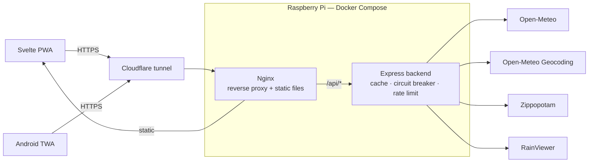

# Architecture

🇫🇷 [Version française](./architecture.md)

[Back to README](../README.en.md)

System overview, from the browser to the external APIs:



The browser and the Android app both go through the same Cloudflare tunnel and the same nginx
instance: the TWA is just a shell that loads the PWA from `qcweather.alithiel31.dev`, it never
talks to the backend directly. Nginx serves static files and routes `/api/*` to the Express
backend same-origin (see the [Deployment](../README.en.md#deployment-docker) section of the README). The Express backend is the only
component that calls the external APIs, behind the caching, request-coalescing, and
circuit-breaker layer described in "[Upstream resilience](#upstream-resilience)" further down — never directly from the
browser.

---

## Upstream resilience

Three mechanisms, all visible in `/api/sante`:

- **Request coalescing** — N concurrent requests on a cold key trigger only one upstream call.
  Since the TTL is fixed, all warm keys expire together: without this, the burst following an
  expiry would go to the provider in full.
- **Degraded service** — a stale entry stays servable for `CACHE_FACTEUR_OBSOLETE × TTL`, but
  only if the upstream just failed. The response then carries `obsolete: true`, which the app
  displays: a twenty-minute-old forecast beats an error screen. On the service worker side, a
  Workbox plugin treats a 5xx as a network failure — otherwise `NetworkFirst` would never fall
  back to the cache, a 502 being a *resolved* response.
- **Circuit breaker** — past `BREAKER_SEUIL_ECHECS` consecutive failures, calls to that
  upstream are suspended for `BREAKER_REPOS_MS` and respond **503** immediately, then a single
  request tests whether the service is back. Without it, a dead upstream would tie up ~10 s of
  connection per request, multiplied by the number of clients — on a Pi capped at 256 MB, a
  third-party outage became a local resource exhaustion.

An invalid environment variable (`PORT=abc`, empty quota) fails startup while naming it,
instead of letting the server run with a `NaN`.

> **Calibrating `TRUST_PROXY_HOPS`** — rate limiting applies per client IP. Behind cloudflared
> then nginx, you need to walk back 2 hops to recover the real client; misconfigured, all
> visitors share the same counter. After an infrastructure change, verify with
> `curl -s https://qcweather.alithiel31.dev/api/villes -D - | grep -i ratelimit` from two
> different networks: the counters must be independent.

---

## Structure

```
meteo-qc/
├── docker-compose.yml
├── backend/
│   ├── app.ts                        # Entry point (startup, graceful shutdown)
│   ├── .env.example                  # Environment variables template
│   └── src/
│       ├── index.ts                  # Builds the Express app
│       ├── config.ts                 # Validated environment variables (Zod)
│       ├── data/cities.ts            # Cities and coordinates
│       ├── routers/                  # Route definitions
│       ├── controllers/              # Request logic
│       ├── services/                 # Open-Meteo, geocoding, RainViewer, cache, weather alerts
│       ├── middlewares/              # Errors, rate-limit, request-id, access log
│       ├── schemas/                  # Zod validation of upstream responses
│       └── lib/                      # Circuit breaker, errors, log, HTTP requests
└── frontend/
    ├── src/
    │   ├── main.ts                        # App mount + service worker
    │   ├── App.svelte                     # Active city, dynamic sky
    │   ├── sw.ts                          # Service worker (precache, push, notificationclick)
    │   └── lib/
    │       ├── Horaire.svelte             # 48 h hourly strip
    │       ├── CarteNuages.svelte         # Animated Leaflet map
    │       ├── Quotidien.svelte           # 7-day forecast
    │       ├── ConditionsActuelles.svelte # Temperature, feels-like, wind, humidity
    │       ├── RechercheCodePostal.svelte # Postal code or city name search
    │       ├── AlertesMeteo.svelte        # Weather alert subscription control
    │       ├── notifications.ts           # PushManager subscribe/unsubscribe
    │       ├── animationFrames.svelte.ts  # Map animation state machine
    │       ├── preferences.svelte.ts      # Remembered city and preferences
    │       ├── stockage.ts                # Failure-tolerant localStorage access
    │       ├── api.ts                     # Backend and RainViewer calls
    │       ├── meteo.ts                   # WMO codes → labels, icons
    │       └── types.ts                   # TypeScript interfaces
    └── tests/
        ├── unit/                   # meteo.ts, api.ts
        ├── composants/             # Svelte rendering (Testing Library)
        ├── pwa/                    # Installable manifest + service worker
        └── helpers/                # Fetch stubs
```
