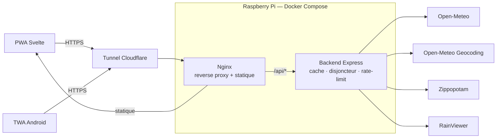

# Architecture

🇬🇧 [English version](./architecture.en.md)

[Retour au README](../README.md)

Vue d'ensemble du système, du navigateur jusqu'aux APIs externes :



Le navigateur et l'app Android passent tous deux par le même tunnel Cloudflare et la même
instance nginx : la TWA n'est qu'une coquille qui charge le PWA depuis
`qcweather.alithiel31.dev`, elle ne parle jamais directement au backend. Nginx sert les
fichiers statiques et route `/api/*` vers le backend Express en same-origin (voir la section
[Déploiement](../README.md#déploiement-docker) du README). Le backend Express est le seul composant qui appelle les APIs
externes, derrière la couche de cache, de mutualisation des requêtes et de disjoncteur décrite
dans « [Résilience des amonts](#résilience-des-amonts) » plus bas — jamais directement depuis le navigateur.

---

## Résilience des amonts

Trois mécanismes, tous visibles dans `/api/sante` :

- **Mutualisation** — N requêtes simultanées sur une clé froide ne déclenchent qu'un seul appel
  amont. Le TTL étant fixe, toutes les clés chaudes expirent ensemble : sans cela, la rafale
  suivant une expiration partait en entier chez le fournisseur.
- **Service dégradé** — une entrée périmée reste servable `CACHE_FACTEUR_OBSOLETE × TTL`, mais
  uniquement si l'amont vient d'échouer. La réponse porte alors `obsolete: true` et
  l'application l'affiche : des prévisions d'il y a vingt minutes valent mieux qu'un écran
  d'erreur. Côté service worker, un greffon Workbox traite un 5xx comme une panne réseau —
  sans quoi `NetworkFirst` ne consultait jamais le cache, un 502 étant une réponse *résolue*.
- **Disjoncteur** — au-delà de `BREAKER_SEUIL_ECHECS` échecs consécutifs, les appels à cet
  amont sont suspendus pendant `BREAKER_REPOS_MS` et répondent **503** immédiatement, puis une
  seule requête teste le retour du service. Sans lui, un amont mort immobilisait ~10 s de
  connexion par requête, multipliées par le nombre de clients — sur un Pi borné à 256 Mo, une
  panne tierce devenait un épuisement local.

Une variable d'environnement invalide (`PORT=abc`, quota vide) fait échouer le démarrage en la
nommant, au lieu de laisser tourner le serveur avec un `NaN`.

> **Calibrage de `TRUST_PROXY_HOPS`** — la limitation de débit s'applique par IP cliente.
> Derrière cloudflared puis nginx, il faut remonter 2 sauts pour retrouver le vrai client ;
> mal réglé, tous les visiteurs partagent le même compteur. Après un changement d'infra,
> vérifier avec `curl -s https://qcweather.alithiel31.dev/api/villes -D - | grep -i ratelimit`
> depuis deux réseaux différents : les compteurs doivent être indépendants.

---

## Structure

```
meteo-qc/
├── docker-compose.yml
├── backend/
│   ├── app.ts                        # Point d'entrée (démarrage, arrêt gracieux)
│   ├── .env.example                  # Template des variables d'environnement
│   └── src/
│       ├── index.ts                  # Construction de l'app Express
│       ├── config.ts                 # Variables d'environnement validées (Zod)
│       ├── data/cities.ts            # Villes et coordonnées
│       ├── routers/                  # Définition des routes
│       ├── controllers/              # Logique des requêtes
│       ├── services/                 # Open-Meteo, géocodage, RainViewer, cache, alertes météo
│       ├── middlewares/              # Erreurs, rate-limit, request-id, accès
│       ├── schemas/                  # Validation Zod des réponses amont
│       └── lib/                      # Disjoncteur, erreurs, log, requêtes HTTP
└── frontend/
    ├── src/
    │   ├── main.ts                        # Montage de l'app + service worker
    │   ├── App.svelte                     # Ville active, ciel dynamique
    │   ├── sw.ts                          # Service worker (précache, push, notificationclick)
    │   └── lib/
    │       ├── Horaire.svelte             # Bandeau 48 h
    │       ├── CarteNuages.svelte         # Carte Leaflet animée
    │       ├── Quotidien.svelte           # Prévisions 7 jours
    │       ├── ConditionsActuelles.svelte # Température, ressenti, vent, humidité
    │       ├── RechercheCodePostal.svelte # Recherche par code postal ou nom de ville
    │       ├── AlertesMeteo.svelte        # Contrôle d'abonnement aux alertes météo
    │       ├── notifications.ts           # Abonnement/désabonnement PushManager
    │       ├── animationFrames.svelte.ts  # Machine d'animation de la carte
    │       ├── preferences.svelte.ts      # Ville et préférences mémorisées
    │       ├── stockage.ts                # Accès localStorage tolérant aux pannes
    │       ├── api.ts                     # Appels backend et RainViewer
    │       ├── meteo.ts                   # Codes WMO → labels FR, icônes
    │       └── types.ts                   # Interfaces TypeScript
    └── tests/
        ├── unit/                   # meteo.ts, api.ts
        ├── composants/             # Rendu Svelte (Testing Library)
        ├── pwa/                    # Manifeste installable + service worker
        └── helpers/                # Stubs de fetch
```
